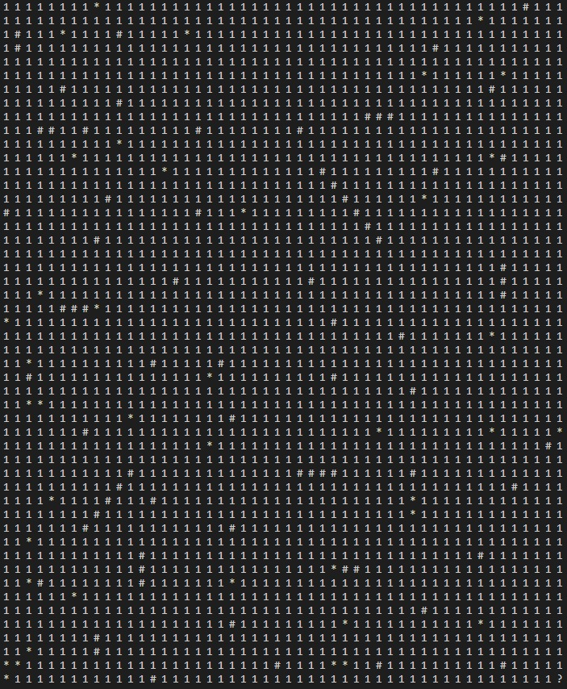
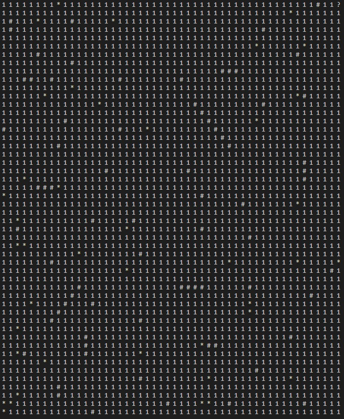

# BFS_DFS_ALEATORIO

 
 
</a> 

# Problema Proposto
Este projeto apresenta objetivo de mostrar o processo de caminhamento por matrizes utilizando 3 tipos de algoritmos diferentes, em largura BFS, profundidade DFS e aleatorio. O caminhamento deve ocorrer em uma única matriz de tamanho N x N. Nesta haverá quatro tipos de elementos importantes espalhados aleatoriamente:  
- item de passagem livre representado pelo numero `1`.
- item de dano, representado pelo carácter `*`. 
- parade definidas como `#`. 
- item de finalizacao, representado pelo caracter `?` que indica o ponto de parada da exploração. 

Esses caracteres estarao posicionados de forma randômica na matriz em qualquer uma das posições tidas como válidas. Tem-se como regra a condição de dano, qual obriga o algoritmo a voltar no estágio inicial de execução e reiniciar novamente do zero toda a execução caso o caracter `*` seja atingido. Ao sofrer um dano o algoritmo deve demarcar a posição com o item `1`, neutralizando o mesmo e abrindo novas possibilidades de rotas para caminhar até o estágio de finalização. 

# Observacoes
> Durante esse projeto, imagens sao apresentadas, estas imagens seguem todas o mesmo padrao de cores, este padrao esta explicado abaixo.  
 
  
 
 
# Largura BFS
A busca em largura BFS, é um algoritmo utilizado para percorrer ou buscar em uma estrutura de dados que pode ser representada como um grafo ou uma árvore, neste projeto utiliza-se uma matriz. Nesse algoritmo, a exploração começa no vértice ou nó raiz e se expande gradualmente para os vértices ou nós vizinhos de forma nivelada, ou seja, explora todos os vértices vizinhos de um determinado nível antes de avançar para o próximo nível. Isso significa que a busca em largura visita todos os vértices em um nível antes de prosseguir para o próximo nível. Durante a busca em largura, um conjunto de vértices ou nós visitados é mantido para garantir que cada vértice seja visitado apenas uma vez. Além disso, uma estrutura de dados chamada fila é utilizada para determinar a ordem de exploração dos vértices ou nós. A estrutura da fila, e um conjunto dinâmico de inserção e remoção de dados, no qual o elemento removido e o que está no conjunto a mais tempo. A fila apresenta a política de primeiro a entrar o primeiro a sair, ou FIFO(First in First out).  
A busca em largura BFS, é um algorítmo utilizado para percorrer ou buscar em uma estrutura, nesse caso uma matriz, que mantém uma ordem de prioridade de movimento até encontrar seu objetivo, nesse caso uma posição. O algorítmo apresentado inicia sua busca na posição [0][0] da matriz, a partir desse ponto de partida, o algorítimo faz a busca em largura da seguinte forma:
- visita todos os vizinhos da posicao atual antes de prosseguir para a proxima posicao, neste caso, todas as posicoes ao redor da posicao atual sao olhadas e guardadas na estrutura `FILA`, a posicao que esta na primeira posicao da `FILA` e a posicao que tera as suas casas visitadas.
 
  
 
 
- Caso encontre algum perigo `*`, ele reinicia a busca, voltando à posição inicial, e modifica a posição que continha um perigo para o número `1`.
- Caso encontre uma parede `#`, ele nao considera esta uma posicao possivel de se andar e continua olhando as posicoes vizinhas a atual.
- Caso o algorítmo encontre `1`,`*` ou `?` sao posicoes possiveis de se adicionar a `FILA`.
- Quando o sistema de busca em largura apresentado encontrar uma posição que armazene o caracter `?`, a busca é interrompida e é exibido quanto tempo demorou para a busca ser realizada e quantas casas foram percorridas.  

  
 

  
 

  
 

  
 

  
 

# Profundidade DFS
A busca em profundidade DFS, é um algorítmo utilizado para percorrer ou buscar em uma estrutura, nesse caso uma matriz, que mantém uma ordem de prioridade de movimento até encontrar seu objetivo, nesse caso uma posição. O algorítmo apresentado inicia sua busca na posição [0][0] da matriz, a partir desse ponto de partida, o algorítimo faz a busca em profundidade da seguinte forma:
- Busca as casas abaixo até chegar na última linha.
- Caso encontre algum perigo `*`, ele reinicia a busca, voltando à posição inicial, e modifica a posição que continha um perigo para o número `1`.
- Caso encontre uma parede `#`, ele desvia tal posição seguindo a seguinte ordem de movimento até encontrar uma posição possível de movimento, representada pelo número `1` ou pelo `*`:
  - Direção sul -> Direção Oeste -> Direção Norte -> Direção Leste.
- Caso o algorítmo se encontre em uma posição em que todas os movimentos disponíveis são impossíveis, ele utiliza do auxílio da estrutura de `PILHA`, que funciona da seguinte forma:
  - A cada movimento, a posição atual de busca é armazenada na estrutura de pilha.
  - Quando o algorítmo identificar o caso de `BECO SEM SAÍDA`, a estrutura irá remover a última posição armazenada e verificar se, a partir da nova posição do "topo" da pilha, é possível de se movimentar para alguma posição. A pilha funciona no sistema de LIFO (Last in First out), logo esse processo é repetido até ser possível de se realizar um movimento.
- Quando o sistema de busca em profundidade apresentado encontrar uma posição que armazene o caracter `?`, a busca é interrompida e é exibido quanto tempo demorou para a busca ser realizada e quantas casas foram percorridas. 
 

  
 

  
 

  
 

  
 

  
 
 
# Aleatorio
O algoritmo randômico, é um algoritmo que incorpora elementos de aleatoriedade em sua execução ou tomada de decisões. Diferentemente dos algoritmos determinísticos, que produzem sempre o mesmo resultado para uma determinada entrada, os algoritmos randômicos introduzem incerteza ou imprevisibilidade em suas ações. Além disso, não e necessária uma estrutura de dados para conciliar seu funcionamento, uma vez que não apresenta um padrão.
- Iniciando no ponto [0][0], o algorítmo randômico pode andar uma posição por vez em qualquer direção.
- Caso o algorítmo randomize um caminho em que todas as posições adjascentes à atual sejam impossíveis se serem percorridas (armazenem os caracteres `#`, `0` ou se localizarem em posições extremas da matriz), o próximo movimento será o retorno à posição [0][0] e, posteriormente, o início de um novo caminho de busca randômica.

  
 

  
 

  
 

  
 

  
 

  
 

# Lógica
> As lógicas de execução de cada forma de busca serão representadas e explicadas através da exibição das linhas que contém cada função do código em c++.  
A funcao `read()` e a principal função, ela é criada em todos os processos de caminhamento, nela ocorre a leitura do arquivo, durante o processo de leitura os valores são guardados em das matrizes, uma que é utilizada para alterar os valores durante os processos de caminhamento, e a outra que é utilizada para salvar a matriz, pois em todos os processos de caminhamento, quando a matriz estiver em uma posição que tem o caracter `*`, o valor atual recebe o caracter `1` e a matriz é reiniciada para realizar todo o processo de caminhamento novamente, porém com o valor `1` onde havia o caracter `*` achado.   Esse processo de troca tambem é realizado em todos os processos de caminhamento. Para o caso em que o arquivo de entrada tivesse apenas um `\n` ao final, a leitura do arquivo considerava essa última linha já como o final do arquivo, o que interrompia o loop de leitura e não permitia que a última matriz fosse percorrida(não entrava no else). Para resolver este problema, foi criado um booleano decisao que é responsável por tomar a decisão se a última matriz salva já foi percorrida ou não. Este `booleano` é iniciado com `false`, e recebe falso toda vez que uma linha é `tokenizada`. O `true` só é atribuído à variável no `else`, onde as matrizes são percorridas. 
Então, por meio de um `if` após o loop de leitura, no caso onde o input do programa tivesse dois `\n`, a variável booleana iria impedir a matriz de ser caminhada duas vezes, e no caso de apenas um `\n`, ela seria percorrida dentro do `if`, finalizando o percorrimento de todas as matrizes corretamente. Ao acabar de salvar a matriz, é chamada a função do processo de caminhamento que está sendo realizado, estes processos são explicados separadamente abaixo:  

### Largura
O arquivo `largura.cpp` trabalha com as funcoes criadas no arquivo `largura.hpp`. As funcoes `read()` e `imprimindo()` sao funcoes "padrao" para todos os tipos de busca, ja as funcoes `movimento()` e `movimento_x_y()` sao especificas para o BFS.
- Inicialmente, a funcao `movimento()` recebe como parametro a posicao inicial [0][0], a fila e as matrizes, que ja haviam sido criadas, valendo observar que a posicao incial ja foi adicionada a fila, apos isso inicia um loop ate que o caracter `?` nao seja a posicao atual.
- Dentro do loop, ocorre o processo de verificar se o caracter `?` caso for o loop se encerra, ocorre a verificao se o caracter e `*` caso for o processo de reinicializacao e feito, este que ja foi explicado acima. Apos esta verificacao incical, comeca a verificacao de qual e a posicao atual, pois existem posicoes que caem em casos de excecao. Dentro de cada `if` ou `else if`, que sao as excessoes tratadas, e chamada a funcao `movimento_x_y()`. Antes de ser chamada e somado ou subtraido 1 da linha e coluna para passar a posicao de comparacao das casas vizinhas, a soma ou subtracao e feita de maneira a respeitar a condicao de movimento do BFS para que dentro da funcao ocorra a comparacao com caracteres da posicao vizinha que esta sendo analisada, apos finalizar a funcao e somado ou subtraido 1 da linha e coluna para voltar ao valor da posicao atual. 
- A funcao `movimento_x_y()` e resposavel por verificar qual caracter esta na posicao vizinha e enfileirar a posicao quando necessario.
 - Se a posicao recebida como parametro for `#` nao e adicionada a fila.
 - Se nao, se a posicao for diferente de `X` e feita outra verificacao.
   - Se a posicao e diferente de `?` e de `*` e de `0` (posicao que pela qual o algoritmo ja caminhou), a posicao olhada recebe `X` que siginifica que aquela posicao ja foi olhada e e adicionada a fila apartir da funcao `enfileira()`.
   - Se for igual a `?` e se for igual a `*` a posicao tambem e adicionada a fila apartir da funcao `enfileira()`.

Apos realizar toda sequencia de `if` e `else ifs` o algoritmo chama a funcao `desenfileira()`, esta e responsavel por retirar da primeira posicao da fila a posicao da iteracao atual, da qual ja foram salvos a fila todas as posicoes vizinhas a serem verificadas posteriormente. 
### Profundidade
O arquivo `profundidade.cpp` trabalha com as funções criadas no arquivo `profundidade.hpp`. As funções `read2()` e `print()` são funções "padrão" para todos os tipos de busca, já as `profundidade()` e `beco_sem_saida()` são específicas para o DFS.
- Inicialmente, a função `profundidade()` inclui a posição inicial [0][0] na pilha que armazena cada posição percorrida e substitui o caracter `1` da posição inicial pelo `0`. Depois inicia um loop do tipo `do while` até atingir o caracter `?` que representa o objetivo da busca.
- Dentro do loop, uma variável do tipo `booleana` controla se a posição atual mudou ou não. (linha 108)
- O processo de caminhamento funciona seguindo uma ordem de prioridade, representada por um `if` seguido de `else if´s`.
  - 1ª prioridade: `Direção Sul` (linha 110)
  - 2ª prioridade: `Direção Leste` (linha 146)
  - 3ª prioridade: `Direção Norte` (linha 182)
  - 4ª prioridade: `Direção Oeste` (linha 218)
- Dentro de cada estrutura condicional, responsável pelo movimento, a nova posição atual é adicionada à `pilha`, as coordenadas `X` e `Y` são modificadas e o booleano `andou` passa a ser `true`, representando que o movimento foi concluído com sucesso. Além disso, existe uma condicional `if` dentro dessa estrutura, que verifica se a próxima posição acessada contém um caracter `*`, que representa o `perigo`. Caso esse seja o caso, a variável `casas_percorridas` é zerada, a posição que continha um perigo é modificada para `1`e a pilha é resetada.
- Caso nenhum movimento seja possível, o penúltimo `if` dentro da estrutura `do while` é acionado (linha 254). Ele verifica se ainda não ouve caminhamento e se a função `beco_sem_saida()` retornou `true`, se for esse o caso, o algorítmo retorna à posição inicial e reinicia a busca. 
- A função `beco_sem_saida()` (linha 284) funciona da seguinte forma:
  - Ela verifica, dependendo da posição atual na matriz, se é possível a movimentação em alguma direção. Caso seja impossível essa movimentação, a posição atual se encontra em um beco sem saída e a função retornará `true`.
- Por fim, a última estrutura condicional `if` (linha 263), verifica se a posição atual armazena o caracter `?`, se for esse o caso, o algorítmo finaliza sua execução, exibindo o tempo de busca e as casas percorridas. A variável string `comparacao`, responsável por interromper o `do while` passa a armazenar `?`, interrompendo a repetição e finalizando o código.

### Randômico
O arquivo `aleatorio.cpp` trabalha com as funções criadas no arquivo `aleatorio.hpp`. As funções `read3()` e `print1()` são funções "padrão" para todos os tipos de busca, já as `randomico()` e `beco_sem_saida1()` são específicas para o algorítmo de busca aleatória.
- Em primeiro lugar, a função `aleatorio()` inicializa as variáveis responsáveis pela orientação de movimentação na matriz (linhas 83 a 93). Em seguida, inicializa uma estrutura de repetição `do while` que será executada até a posição atual contiver o caracter `?` (linha 95). 
- Dentro da estrutura de repetição, é randomizado um número de 1 a 8 (linha 96), cada número é responsável por uma direção de movimento. 
  - `Norte 1` (linha 98)
  - `Leste 2` (linha 138)       
  - `Sul   3` (linha 178)       
  - `Oeste 4` (linha 218)      
  - `Nordeste 5` (linha 258)
  - `Sudeste 6` (linha 299)
  - `Sudoeste 7` (linha 340)
  - `Noroeste 8` (linha 381)
- Cada movimento é coordenado por uma estrutura condicionao `if`, e dentro dessas estruturas existem, basicamente, os mesmos comandos, mudando apenas a orientação de direção de busca.
  - Inicialmente, é verificado se a posição atual da busca contém o caracter `?`, se for o caso, a repetição é interrompida, é exibido o tempo de busca, a quantidade de casas percorridas e a busca enfim alcança seu objetivo.
  - Outra verificação é se a posição atual armazena o caracter `*`, que representa o perigo. Se for esse o caso, a contagem de casas percorridas é zerada, a posição passa a armazenar o caracter `1` e a busca é reiniciada.
  - Por fim, caso nenhuma das últimas condições seja satisfeita, a busca avança uma posição e modifica o caracter `1` por `0`, representando uma posição já explorada.
- A última condicional da estrutura `do while` de repetição verifica se a função booleana `beco_sem_saida1()` (linha 441) retornou `true`. Caso isso ocorra, a posição atual se encontra em um beco sem saída e não há movimentação alguma para ser feita. Então, a busca é reiniciada da posição inicial.

# Resultados 
Considerando a logica e a descricao do problema descrito acima, os resultados esperados durante a leitura do arquivo com uma matriz 50x50:  

 

  

Em cada caso de caminhamento e mostrado a matriz inicial, apresentam o numero de casas percorridas, e o tempo gasto para encontrar a posicao que apresenta o caracter `?`, e apos isso a matriz alterado pelo caminhamento.
   
# Custo computacional 
> Tomando como base uma mesma matriz de tamanho `50x50`, apresentada no arquivo `input.data`, foi feita uma análise dos três tipos de busca, mudando apenas a localização do objetivo `?`.
Essa análise é feita a partir da média de tempo necessária para se encontrar a `?` entre sete execuções do código.  

### Objetivo na posição [49][49]

  
 

- A busca em profundidade demorou, em média, 0.00035233 segundos para encontrar a `?`.
- A busca em largura demorou, em média, 0.1863797 segundos para encontrar a `?`.
- A busca randômica demorou, em média, 35.3264 segundos para encontrar a `?`. 

### Objetivo na posição [1][4]

  
 

- A busca em profundidade demorou, em média, 0.309981 segundos para encontrar a `?`.
- A busca em largura demorou, em média, 0.001783 segundos para encontrar a `?`.
- A busca randômica demorou, em média, 0.007562 segundos para encontrar a `?`. 

### Objetivo na posição [0][49]

  
 

- A busca em profundidade demorou, em média, 0.029897 segundos para encontrar a `?`.
- A busca em largura demorou, em média, 0.000422 segundos para encontrar a `?`.
- A busca randômica demorou, em média, 5.344833 segundos para encontrar a `?`. 

### Comparacao entre os caminhamentos

Apartir dos testes realizados acima entre os caminhamentos BFS, DFS e aleatorio, e possivel concluir que cada um deles se destaca em certas situacoes, levando a analisar que os algoritmos apresentam diferentes resultados dependendo da entrada de dados. Com por exemplo, no caso onde a posicao final e [49][49] a busca em profundida apresenta melhor desempenho, no caso onde a posicao final e [1][4] a busca em largura apresenta melhor desempenho e o aleatorio apresenta um desempenho ainda melhor que o de profundidade, provando que o resultado varia frente a entrada. A busca em profundidade apresenta um bom desempenho em situacoes onde sua sequencia de movimento passa pelo ponto final, pois mesmo que a posicao final esteja muito proxima ela seguira seu caminho ate que nao seja possivel mais andar pra uma certa direcao. A busca em largura se discipa como se fosse uma onda, entao em casos que a posicao final esta mais proxima da posicao incial ela apresenta um bom desempenho, se a posicao final esta longe da posicao incial tende a demorar um tempo maior, ja que ela passa por todas as posicoes possiveis. A busca de forma aleatoria nao apresenta um padrao, mas tende-se a apresentar melhores resultados com a posicao final proxima da posicao incial, uma vez que sao necessarios menos movimentos para alcanca-la.
# Conclusão 

# Bibliotecas 

Para o funcionamento do programa, é necessário incluir as seguintes bibliotecas: 
<ul>
    <li><code>#include 'iostream'</code></li>
    <li><code>#include 'fstream'</code></li>
    <li><code>#include 'vector'</code></li>
    <li><code>#include 'string'</code></li>
    <li><code>#include 'sstream'</code></li>
    <li><code>#include 'iterator'</code></li>
    <li><code>#include 'algorithm'</code></li>
    <li><code>#include 'time.h'</code></li>
    <li><code>#include 'unistd.h'</code></li>
    <li><code>#include 'ctime'</code></li>
    <li><code>#include 'chrono'</code></li>
</ul>

# Compilação e Execução

Esse pequeno exemplo possui um arquivo Makefile que realiza todo o procedimento de compilação e execução. Para tanto, temos as seguintes diretrizes de execução:

| Comando                |  Função                                                                                           |                     
| -----------------------| ------------------------------------------------------------------------------------------------- |
|  `make clean`          | Apaga a última compilação realizada contida na pasta build                                        |
|  `make`                | Executa a compilação do programa utilizando o g++, e o resultado vai para a pasta build           |
|  `make run`            | Executa o programa da pasta build após a realização da compilação                                 |

# Contatos

#### Felipe Werneck

#### Felipe Parreiras

 

