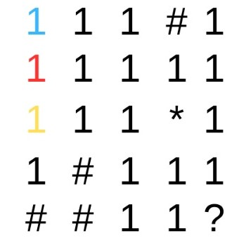
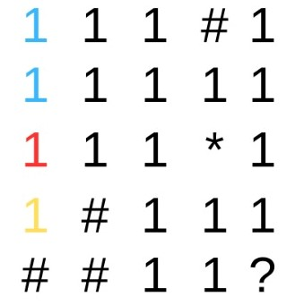
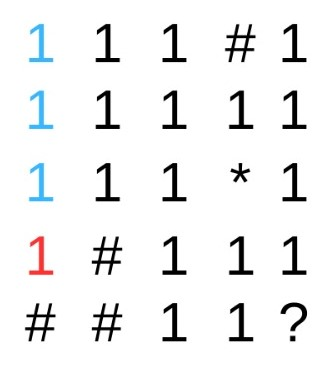

# BFS_DFS_ALEATORIO

 
 
</a> 

# Problema Proposto
Este projeto apresenta objetivo de mostrar o processo de caminhamento por matrizes utilizando 3 tipos de algoritmos diferentes, em largura BFS, profundidade DFS e aleatorio. O caminhamento deve ocorrer em uma única matriz de tamanho N x N. Nesta haverá quatro tipos de elementos importantes espalhados aleatoriamente:  
- item de passagem livre representado pelo numero `1`.
- item de dano, representado pelo carácter `*`. 
- parade definidas como `#`. 
- item de finalizacao, representado pelo caracter `?` que indica o ponto de parada da exploração. 

Esses caracteres estarao posicionados de forma randômica na matriz em qualquer uma das posições tidas como válidas. Tem-se como regra a condição de dano, qual obriga o algoritmo a voltar no estágio inicial de execução e reiniciar novamente do zero toda a execução caso o caracter `*` seja atingido. Ao sofrer um dano o algoritmo deve demarcar a posição com o item `1`, neutralizando o mesmo e abrindo novas possibilidades de rotas para caminhar até o estágio de finalização. 

# Observacoes
> Durante esse projeto, imagens sao apresentadas, estas imagens seguem todas o mesmo padrao de cores, este padrao esta explicado abaixo.  
 
  
 
 
# Largura BFS
A busca em largura BFS, é um algoritmo utilizado para percorrer ou buscar em uma estrutura de dados que pode ser representada como um grafo ou uma árvore, neste projeto utiliza-se uma matriz. Nesse algoritmo, a exploração começa no vértice ou nó raiz e se expande gradualmente para os vértices ou nós vizinhos de forma nivelada, ou seja, explora todos os vértices vizinhos de um determinado nível antes de avançar para o próximo nível. Isso significa que a busca em largura visita todos os vértices em um nível antes de prosseguir para o próximo nível. Durante a busca em largura, um conjunto de vértices ou nós visitados é mantido para garantir que cada vértice seja visitado apenas uma vez. Além disso, uma estrutura de dados chamada fila é utilizada para determinar a ordem de exploração dos vértices ou nós. A estrutura da fila, e um conjunto dinâmico de inserção e remoção de dados, no qual o elemento removido e o que está no conjunto a mais tempo. A fila apresenta a política de primeiro a entrar o primeiro a sair, ou FIFO(First in First out).  
A busca em largura BFS, é um algorítmo utilizado para percorrer ou buscar em uma estrutura, nesse caso uma matriz, que mantém uma ordem de prioridade de movimento até encontrar seu objetivo, nesse caso uma posição. O algorítmo apresentado inicia sua busca na posição [0][0] da matriz, a partir desse ponto de partida, o algorítimo faz a busca em largura da seguinte forma:
- visita todos os vizinhos da posicao atual antes de prosseguir para a proxima posicao, neste caso, todas as posicoes ao redor da posicao atual sao olhadas e guardadas na estrutura `FILA`, a posicao que esta na primeira posicao da `FILA` e a posicao que tera as suas casas visitadas.
 
  
 
 
- Caso encontre algum perigo `*`, ele reinicia a busca, voltando à posição inicial, e modifica a posição que continha um perigo para o número `1`.
- Caso encontre uma parede `#`, ele nao considera esta uma posicao possivel de se andar e continua olhando as posicoes vizinhas a atual.
- Caso o algorítmo encontre `1`,`*` ou `?` sao posicoes possiveis de se adicionar a `FILA`.
- Quando o sistema de busca em largura apresentado encontrar uma posição que armazene o caracter `?`, a busca é interrompida e é exibido quanto tempo demorou para a busca ser realizada e quantas casas foram percorridas.  

  
 

  
 

  
 

  
 

  
 

# Profundidade DFS
A busca em profundidade DFS, é um algorítmo utilizado para percorrer ou buscar em uma estrutura, nesse caso uma matriz, que mantém uma ordem de prioridade de movimento até encontrar seu objetivo, nesse caso uma posição. O algorítmo apresentado inicia sua busca na posição [0][0] da matriz, a partir desse ponto de partida, o algorítimo faz a busca em profundidade da seguinte forma:
- Busca as casas abaixo até chegar na última linha.
- Caso encontre algum perigo `*`, ele reinicia a busca, voltando à posição inicial, e modifica a posição que continha um perigo para o número `1`.
- Caso encontre uma parede `#`, ele desvia tal posição seguindo a seguinte ordem de movimento até encontrar uma posição possível de movimento, representada pelo número `1` ou pelo `*`:
  - Direção sul -> Direção Oeste -> Direção Norte -> Direção Leste.
- Caso o algorítmo se encontre em uma posição em que todas os movimentos disponíveis são impossíveis, ele utiliza do auxílio da estrutura de `PILHA`, que funciona da seguinte forma:
  - A cada movimento, a posição atual de busca é armazenada na estrutura de pilha.
  - Quando o algorítmo identificar o caso de `BECO SEM SAÍDA`, a estrutura irá remover a última posição armazenada e verificar se, a partir da nova posição do "topo" da pilha, é possível de se movimentar para alguma posição. A pilha funciona no sistema de LIFO (Last in First out), logo esse processo é repetido até ser possível de se realizar um movimento.
- Quando o sistema de busca em profundidade apresentado encontrar uma posição que armazene o caracter `?`, a busca é interrompida e é exibido quanto tempo demorou para a busca ser realizada e quantas casas foram percorridas. 
 

  
 

  
 

  
 

  
 

  
 
 
# Aleatorio
O algoritmo randômico, é um algoritmo que incorpora elementos de aleatoriedade em sua execução ou tomada de decisões. Diferentemente dos algoritmos determinísticos, que produzem sempre o mesmo resultado para uma determinada entrada, os algoritmos randômicos introduzem incerteza ou imprevisibilidade em suas ações. Além disso, não e necessária uma estrutura de dados para conciliar seu funcionamento, uma vez que não apresenta um padrão.
- Iniciando no ponto [0][0], o algorítmo randômico pode andar uma posição por vez em qualquer direção.
- Caso o algorítmo randomize um caminho em que todas as posições adjascentes à atual sejam impossíveis se serem percorridas (armazenem os caracteres `#`, `0` ou se localizarem em posições extremas da matriz), o próximo movimento será o retorno à posição [0][0] e, posteriormente, o início de um novo caminho de busca randômica.

# Lógica

# Resultados 
Considerando a logica e a descricao do problema descrito acima, os resultados esperados durante a leitura do arquivo com uma matriz 50x50:  

  
 

  
 

  
 
Todas as matrizes apresentam o numero de casas percorridas, e o tempo gasto para encontrar a posicao que apresenta o caracter `?`.
   
# Custo computacional 
> Tomando como base uma mesma matriz de tamanho `50x50`, apresentada no arquivo `input.data`, foi feita uma análise dos três tipos de busca, mudando apenas a localização do objetivo `?`.
Essa análise é feita a partir da média de tempo necessária para se encontrar a `?` entre três execuções do código.  

### Objetivo na posição [49][49]

  
 

- A busca em profundidade demorou, em média, 0.00035233 segundos para encontrar a `?`.
- A busca em largura demorou, em média, 0.1863797 segundos para encontrar a `?`.
- A busca randômica demorou, em média, 35.3264 segundos para encontrar a `?`. 

### Objetivo na posição [1][4]

  
 

- A busca em profundidade demorou, em média, 0.001783 segundos para encontrar a `?`.
- A busca em largura demorou, em média, 0.309981 segundos para encontrar a `?`.
- A busca randômica demorou, em média, 0.007562 segundos para encontrar a `?`. 

### Objetivo na posição [0][49]

  
 

- A busca em profundidade demorou, em média, 0.029897 segundos para encontrar a `?`.
- A busca em largura demorou, em média, 0.000422 segundos para encontrar a `?`.
- A busca randômica demorou, em média, 5.344833 segundos para encontrar a `?`. 
# Conclusão 

# Bibliotecas 

Para o funcionamento do programa, é necessário incluir as seguintes bibliotecas: 
<ul>
    <li><code>#include 'iostream'</code></li>
    <li><code>#include 'fstream'</code></li>
    <li><code>#include 'vector'</code></li>
    <li><code>#include 'string'</code></li>
    <li><code>#include 'sstream'</code></li>
    <li><code>#include 'iterator'</code></li>
    <li><code>#include 'algorithm'</code></li>
    <li><code>#include 'time.h'</code></li>
    <li><code>#include 'unistd.h'</code></li>
    <li><code>#include 'ctime'</code></li>
    <li><code>#include 'chrono'</code></li>
</ul>

# Compilação e Execução

Esse pequeno exemplo possui um arquivo Makefile que realiza todo o procedimento de compilação e execução. Para tanto, temos as seguintes diretrizes de execução:

| Comando                |  Função                                                                                           |                     
| -----------------------| ------------------------------------------------------------------------------------------------- |
|  `make clean`          | Apaga a última compilação realizada contida na pasta build                                        |
|  `make`                | Executa a compilação do programa utilizando o g++, e o resultado vai para a pasta build           |
|  `make run`            | Executa o programa da pasta build após a realização da compilação                                 |

# Contatos

#### Felipe Werneck

#### Felipe Parreiras

 

